<!-- Generated by GitHub Profile Agent Console. Edit profile.config.json, then run npm run generate. -->

  <picture>
    <source media="(max-width: 760px) and (prefers-color-scheme: dark)" srcset="./assets/hero/agent-console-70c9489d-mobile-dark.svg">
    <source media="(max-width: 760px)" srcset="./assets/hero/agent-console-70c9489d-mobile-light.svg">
    <source media="(prefers-color-scheme: dark)" srcset="./assets/hero/agent-console-70c9489d-dark.svg">
    <source media="(prefers-color-scheme: light)" srcset="./assets/hero/agent-console-70c9489d-light.svg">
    
  </picture>

  
  

## About Me

CS student in Bandung living at the intersection of offensive security and practical software development. Most free time goes into CTF challenges — chaining LFI into RCE through PHP filter injection, escalating privileges on Linux boxes, and picking puzzles apart to see how they tick.

When I'm not popping boxes, I'm building things: role-based POS web apps and full-stack projects, while working through the theory that makes it all click — discrete math, graph theory, linear algebra, and statistics.

## Current Focus

| Area | What I am exploring |
| --- | --- |
| **Web Exploitation** | LFI to RCE chains, PHP filter injection, and practical web attack techniques. |
| **Linux Priv-Esc** | GTFOBins, SUID abuse, systemd enumeration, and privilege escalation paths. |
| **CTF** | TryHackMe and similar platforms, sharpening offensive skills through structured challenges. |
| **Applied Math** | Discrete math, graph theory, linear algebra, and statistics backing real systems. |
| **Full-Stack Dev** | Go and role-based web applications, built with security in mind. |

## Featured Work

| Project | Focus | Why it matters |
| --- | --- | --- |
| [**Kasir POS**](https://github.com/BULLSH4RK/kasir-app) | Point-of-sale web app with role-based access | A Laravel point-of-sale application with role-based access control, products, categories, and transaction management. |

## Research Direction

I approach security through hands-on experimentation: assume nothing, verify everything. I chain web vulnerabilities, escalate privileges on Linux systems, and build tools that turn what I learn into something repeatable and useful.

## Tech Stack

`Go` · `PHP` · `Laravel` · `JavaScript` · `TypeScript` · `Linux` · `Kali Linux` · `TryHackMe` · `WSL2` · `Ollama` · `MySQL` · `Git`

## Recent Activity

<!-- AUTO:ACTIVITY:START -->
_Recent public activity will appear here after the workflow runs._
<!-- AUTO:ACTIVITY:END -->

---

  Assume nothing. Verify everything.

